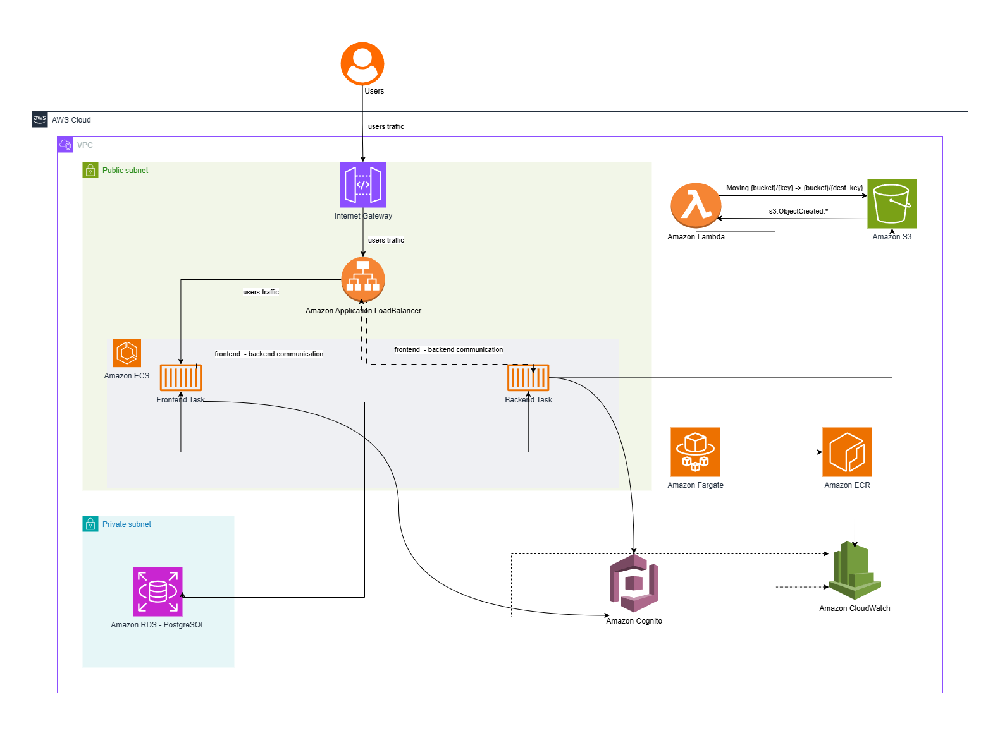
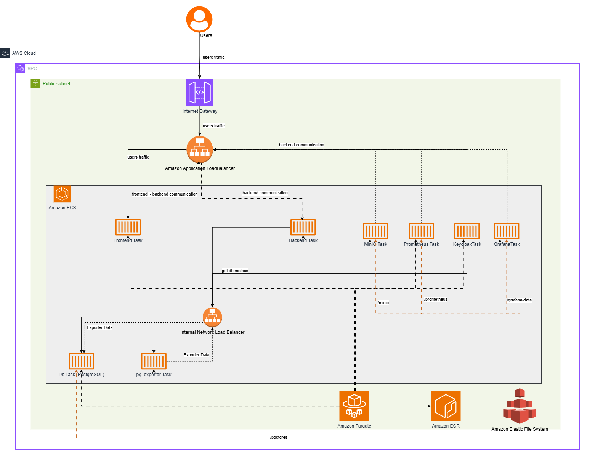

# Cloud Infrastructure Workshop – AWS Native vs AWS Independent

This repository contains two infrastructure-focused subprojects for deploying a containerized web application with **separate frontend and backend services** on AWS.

The main goal of this work was to explore and compare two different infrastructure approaches:

- **AWS Native** – built around managed AWS services,
- **AWS Independent** – deployed on AWS, but using more self-hosted platform components.

From a portfolio perspective, this repository showcases practical work with **Terraform**, **Docker**, **AWS networking**, **container deployment**, **authentication**, **object storage**, **databases**, and **monitoring**.

---

## Repository Overview

```text
.
├── ChmuraInfra-AWS-native/
│   ├── modules/
│   │   ├── alb/
│   │   ├── cognito/
│   │   ├── ecr/
│   │   ├── fargate/
│   │   ├── myLambda/
│   │   ├── rds/
│   │   ├── s3/
│   │   └── vpc/
│   ├── .gitignore
│   ├── .terraform.lock.hcl
│   ├── main.tf
│   ├── outputs.tf
│   ├── providers.tf
│   ├── terraform.tfvars
│   └── variables.tf
│
├── ChmuraInfra-AWS-independent/
│   ├── alb/
│   ├── db/
│   ├── ecr/
│   ├── efs/
│   ├── fargate/
│   ├── keycloak/
│   ├── minio/
│   └── monitoring/
│
├── native.png
├── independent.png
└── README.md
```

---

## What This Repository Demonstrates

- designing infrastructure for a **multi-service web application**,
- deploying **frontend and backend independently**,
- building reusable **Terraform-based infrastructure definitions**,
- working with **managed vs self-hosted platform components**,
- container delivery using **ECR + ECS/Fargate**,
- implementing authentication, storage, persistence, and observability.

---

## Related Application Repositories

These infrastructure projects were prepared for a simple test application used to validate both deployment variants.

### Application repositories

- **ChmuraApp** – sample notes application with support for:
  - text notes,
  - image-based notes,
  - object storage integration using **Amazon S3** or **MinIO**.
  - Repository: [JJv222/ChmuraApp](https://github.com/JJv222/ChmuraApp)

- **ChmuraInfra2App** – related application repository used together with the infrastructure setup and deployment testing.
  - Repository: [JJv222/ChmuraInfra2App](https://github.com/JJv222/ChmuraInfra2App)

These repositories complement this infrastructure project by providing the application layer deployed on top of the environments defined here.

---

## Architecture Variants

| Variant | Folder | Authentication | File Storage | Database | Runtime | Monitoring |
|---|---|---|---|---|---|---|
| AWS Native | `ChmuraInfra-AWS-native` | AWS Cognito | AWS S3 | AWS RDS | ECS Fargate | CloudWatch |
| AWS Independent | `ChmuraInfra-AWS-independent` | Keycloak | MinIO | Self-hosted PostgreSQL | ECS Fargate + EFS | Prometheus + Grafana |

---

# 1. AWS Native Infrastructure

**Folder:** `ChmuraInfra-AWS-native`

This variant follows a more **cloud-native AWS approach**, where the application is deployed using managed platform services wherever possible. It is organized as a modular Terraform project and represents an infrastructure design optimized for tighter AWS integration and lower operational overhead on core platform services.

## Main Components

- **VPC** – network isolation and foundational cloud networking
- **ALB** – traffic routing and public entrypoint for the application
- **ECR** – Docker image registry
- **Fargate** – separate runtime for frontend and backend containers
- **Cognito** – user authentication and identity management
- **S3** – object storage for media files
- **RDS** – managed relational database
- **Lambda** – event-driven or asynchronous processing extensions
- **CloudWatch** – native AWS monitoring and logging

## Why this variant matters

This project demonstrates the ability to work with AWS building blocks typically used in production-style deployments:

- modular Terraform design,
- containerized application deployment,
- managed authentication,
- managed object storage,
- managed relational persistence,
- AWS-native observability,
- infrastructure reproducibility through Infrastructure as Code.

## Terraform Module Layout

```text
ChmuraInfra-AWS-native/
├── modules/
│   ├── alb/
│   ├── cognito/
│   ├── ecr/
│   ├── fargate/
│   ├── myLambda/
│   ├── rds/
│   ├── s3/
│   └── vpc/
├── main.tf
├── variables.tf
├── outputs.tf
├── providers.tf
└── terraform.tfvars
```

## Architecture Diagram



---

# 2. AWS Independent Infrastructure

**Folder:** `ChmuraInfra-AWS-independent`

This variant extends the first project and moves toward a more **provider-independent application layer**. The workload is still deployed on AWS, but several important services are self-hosted instead of being delegated to managed AWS equivalents. This approach gives more control over platform components and better reflects migration or portability-oriented architectures.

## Main Components

- **ALB** – public ingress layer
- **ECR** – image registry for containers
- **Fargate** – application and supporting service runtime
- **EFS** – persistent shared storage where needed
- **Keycloak** – self-hosted authentication and authorization
- **MinIO** – S3-compatible object storage
- **DB** – self-hosted PostgreSQL or MongoDB
- **Prometheus** – metrics collection
- **Grafana** – metrics visualization and dashboards

## Why this variant matters

This project demonstrates experience beyond managed cloud services by covering:

- self-hosted identity management,
- S3-compatible storage outside native S3,
- self-managed data layer,
- monitoring with Prometheus/Grafana,
- infrastructure portability mindset,
- AWS as a hosting platform rather than an all-in managed application stack.

## Folder Layout

```text
ChmuraInfra-AWS-independent/
├── alb/
├── db/
├── ecr/
├── efs/
├── fargate/
├── keycloak/
├── minio/
└── monitoring/
```

## Architecture Diagram



---

## Technical Focus Areas

Across both variants, the repository covers hands-on work in the following areas:

- **Infrastructure as Code** with Terraform
- **Containerization** with Docker
- **AWS networking and deployment**
- **Application delivery with ECS/Fargate**
- **Authentication and authorization architecture**
- **Object storage design**
- **Managed vs self-hosted persistence**
- **Observability and monitoring**
- **Modular infrastructure organization**

---

## Tooling and Stack

- Terraform
- Docker
- AWS CLI
- Amazon ECS / Fargate
- Amazon ECR
- Amazon ALB
- Amazon VPC
- Amazon S3
- Amazon RDS
- AWS Lambda
- Amazon CloudWatch
- Keycloak
- MinIO
- Prometheus
- Grafana
- Amazon EFS

---

## Running the Projects

### Prerequisites

Before applying the infrastructure, make sure you have:

- **Terraform** installed,
- **AWS CLI** configured,
- **Docker** installed,
- valid AWS credentials and required variable values.

### AWS Native

```bash
cd ChmuraInfra-AWS-native
terraform init
terraform plan
terraform apply
```

### AWS Independent

```bash
cd ChmuraInfra-AWS-independent
terraform init
terraform plan
terraform apply
```

---

## Portfolio Summary

This repository reflects practical experience in designing and provisioning cloud infrastructure for modern containerized applications. The strongest value of the project is not just that it deploys services to AWS, but that it compares **two architectural strategies**:

1. **deep integration with managed AWS services**,
2. **greater control through self-hosted platform components running on AWS**.

That comparison makes the project especially useful as a portfolio piece, because it highlights both:

- comfort with the AWS ecosystem,
- and awareness of portability, control, and operational trade-offs.

---

## Notes

- The repository focuses on the **infrastructure and deployment layer**.
- The architecture diagrams are included as `native.png` and `independent.png`.
- The related application repositories provide the sample app used to test the environments defined here.
